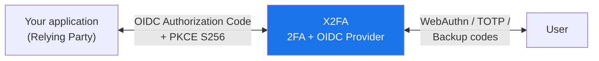

# X2FA — Vision & Manifest

> **X2FA is a lean, self-hosted 2FA and OIDC microservice that developers
> embed as an authentication building block in their applications — without
> handing data to third parties and without operating an enterprise IdM colossus.**

## Why X2FA exists

Anyone who wants strong two-factor authentication for an application today
faces a choice between two unsatisfying poles:

- **Auth SaaS (Auth0, Clerk, Firebase Auth, …)** — quick to integrate, but
  your users' identities live on someone else's servers, outside your control
  and often outside the EU.
- **Enterprise IdM (Keycloak, Authentik, …)** — powerful, but heavyweight:
  dedicated admin UIs, database clusters, JVM or container fleets, hundreds
  of features you will never use. Vastly over-dimensioned for a handful of
  relying parties.

X2FA closes this gap: **one service, one job** — an OIDC provider with real
2FA that runs on a single machine as an unprivileged user and gets by with
SQLite by default.

## AI usage

X2FA is a child of man and AI.
* I am a programmer with 40 years of experience.
* Dolores is my AI peer programmer (DGX10 Local, QWEN 3.6).

Without Dolores I would have never started this project.
I am sure that Dolores may introduce errors, write tests that are nothing but dreams.
But without Dolores I would have written other errors and errorneous tests and still have published x2fa.
I am sure that having a peer programmer even if it is an AI is better than to have none.
And I learned that an AI finds more problems than my real peer.
So please let us accept that AI is a valid peer.  

## Guiding principles

### 1. FIDO2/Passkey-first

WebAuthn is the primary method, not an add-on. Platform authenticators
(Touch ID, Windows Hello) and roaming authenticators (YubiKey, Nitrokey)
come first; TOTP is the documented fallback, backup codes the emergency
exit. Passwords do not exist in X2FA — and never will.

### 2. Data control through self-hosting

All keys, credentials, and audit data stay on your own server. X2FA does
not phone home, contains no telemetry, and pulls in no external services
(QR codes are generated locally as data URIs). If you switch X2FA off,
nothing remains with third parties.

### 3. Lean, not universal

X2FA is deliberately not an identity management system. It manages no user
profiles, no groups, no roles — it cryptographically proves to a relying
party that a user has authenticated with a second factor. Everything beyond
that belongs in the application. One Flask process, one database, done.

### 4. GDPR by design

Data minimization is an architectural decision, not a configuration option:
IP addresses are stored exclusively as `SHA256(ip + SECRET)` in the audit
log, secrets are Fernet-encrypted in the database, backup codes are bcrypt
hashes. There is no plaintext you could lose.

### 5. Standards over reinvention

OIDC Core 1.0, Authorization Code Flow, PKCE S256 (mandatory), ES256 ID
tokens, JWKS, WebAuthn — built on proven libraries (Authlib, py_webauthn,
cryptography). No proprietary flows, no cryptographic experiments.

### 6. Security by default

The secure configuration is the only one: `plain` PKCE is rejected, rate
limits are active on all verification endpoints, challenges are single-use
with a TTL, session state lives server-side instead of in URLs. Security is
not something you turn on — you would have to actively sabotage it.

## Goals

- **Embeddability:** Any OIDC-capable application can integrate X2FA as an
  auth building block in minutes — six client authentication methods from
  mTLS to `client_secret_basic` cover everything from high-security backends
  to small internal tools.
- **Operations without an operator:** The TUI installer, systemd unit,
  Alembic migrations, and `cleanup-codes` make installation and maintenance
  a non-issue.
- **Auditability:** The entire codebase should be readable and auditable by
  one person over a weekend. A small codebase is a security feature.
- **Longevity:** No dependency on commercial services, no forced upgrades,
  migration paths without data loss.

## Non-goals

X2FA deliberately will **not** be:

- a full identity management system (no user lifecycle, no groups/roles)
- a SAML, LDAP, or Kerberos provider
- a social login aggregator ("Sign in with Google/GitHub")
- an admin dashboard with click-ops — administration happens via CLI and TUI
- a hosted SaaS offering or a cloud variant
- a password store or password-based login

These boundaries are part of the promise: what does not exist cannot break,
cannot be attacked, and cannot require maintenance.

## Who X2FA is built for

For **developers** who want strong 2FA for their application — whether a
side project, club software, or a customer product — without outsourcing
identities or building an IdM operation. X2FA runs behind the reverse proxy
next to your app and speaks nothing but OIDC: if you have an OIDC client,
you can use X2FA.

## Success criterion

X2FA succeeds when a developer gets from `git clone` to the first
ES256-signed ID token in a single afternoon — and then forgets the
installation for years, because it simply runs.

## Contributing

X2FA is open source. Contributions that follow the guiding principles —
lean, standards-compliant, secure by default — are welcome. Proposals that
violate the non-goals will be declined, kindly but firmly.
See [CONTRIBUTING.md](CONTRIBUTING.md) and [SECURITY.md](SECURITY.md).

 
