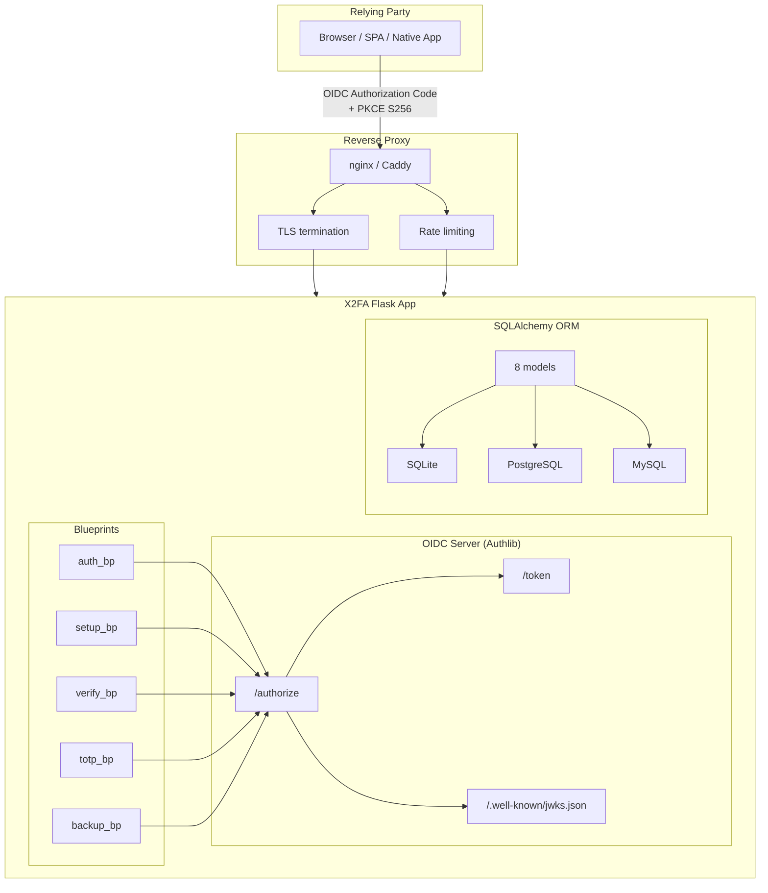
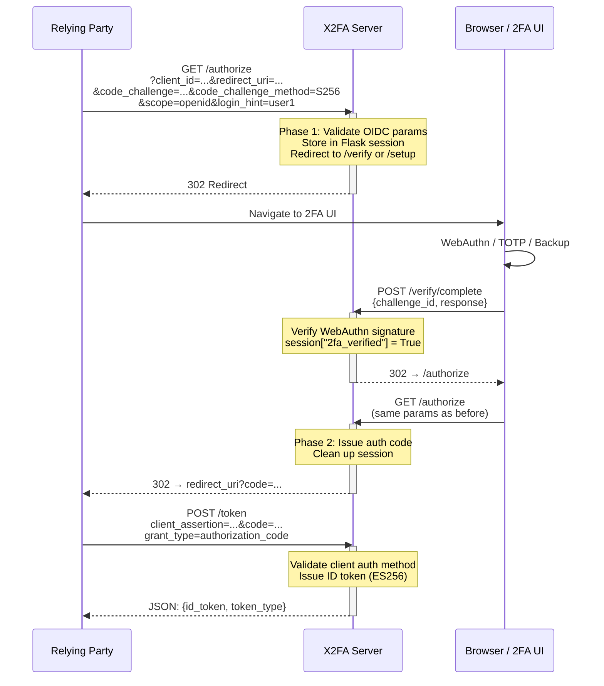

# X2FA — Architecture

X2FA is a FIDO2 / TOTP microservice with an OIDC provider. It handles two-factor
authentication for relying parties (RPs) and supports six client authentication
methods (mTLS, private_key_jwt, self-signed TLS, and three shared-secret variants).

## 1. High-Level Architecture



## 2. Application Factory

The Flask app is created via the factory pattern in `src/x2fa/app.py`:

```python
def create_app() -> Flask:
    app = Flask(__name__, template_folder=str(files("x2fa").joinpath("templates")))
    configure(app)        # TOML config → app.config
    db.init_app(app)      # Flask-SQLAlchemy
    babel(app)            # i18n (German default)
    routes(app)           # Register 5 blueprints + CLI commands
    security(app)         # secure.py headers
    errors(app)           # HTTP error handlers
    limiter.init_app(app) # Flask-Limiter
    return app
```

Extensions are initialized in `src/x2fa/init_app/`:

| Module | Purpose |
|--------|---------|
| `config.py` | Loads TOML files from `~/.config/x2fa/` into `app.config` |
| `database.py` | SQLAlchemy init, `db.session_scope()` context manager |
| `routes.py` | Registers 5 blueprints, calls `register_commands()` |
| `security.py` | Secure headers via `secure` package |
| `limiter.py` | Rate limiting configuration |
| `babel.py` | i18n setup |

## 3. Request Flow

### 3.1 OIDC Authorization Code Flow



### 3.2 Two-Phase Authorization

The `/authorize` endpoint operates in two phases:

1. **Phase 1** — Validates OIDC parameters, stores them in the Flask session,
   redirects to the 2FA UI (`/verify` for login, `/setup` for registration).
2. **Phase 2** — After successful 2FA (`session["2fa_verified"]`), Authlib
   issues the authorization code and redirects to the RP's `redirect_uri`.

This design keeps OIDC parameters out of URLs (no URL-based state).

## 4. Database Models

X2FA uses SQLAlchemy ORM with 8 models across 4 files:

### 4.1 Authentication Models

| Model | Table | Key Fields | Purpose |
|-------|-------|------------|---------|
| `Credential` | `credential` | `credential_id` (PK), `user_id`, `public_key`, `sign_count`, `authenticator_type`, `is_passkey`, `last_used_at` | WebAuthn/FIDO2 credential |
| `TOTPSecret` | `totp_secret` | `user_id` (PK), `secret_encrypted`, `verified`, `last_used_at` | TOTP secret (Fernet-encrypted) |
| `BackupCode` | `backup_code` | `code_hash` (PK), `user_id`, `used_at`, `created_at` | Single-use backup codes (bcrypt-hashed) |
| `Challenge` | `challenge` | `challenge_id` (PK), `user_id`, `challenge` (bytes), `expires_at`, `used` | WebAuthn challenge (5 min TTL, single-use) |

### 4.2 OIDC Models

| Model | Table | Key Fields | Purpose |
|-------|-------|------------|---------|
| `OIDCClient` | `oidc_client` | `client_id` (PK), `redirect_uris`, `allowed_scopes`, `token_endpoint_auth_method`, `jwks_uri`, `client_cert_fingerprint`, `client_secret_encrypted` | Registered OIDC client (RP) |
| `AuthorizationCode` | `authorization_code` | `id`, `code` (unique), `client_id`, `user_id`, `nonce`, `code_challenge`, `expires_at`, `used` | PKCE auth code (60s TTL, single-use) |
| `SigningKey` | `signing_key` | `id`, `kid` (unique), `private_key_encrypted`, `public_key_pem`, `algorithm` (ES256), `active`, `expires_at` | ID token signing key (Fernet-encrypted) |

### 4.3 PKI Model

| Model | Table | Key Fields | Purpose |
|-------|-------|------------|---------|
| `TrustedCA` | `trusted_ca` | `id`, `name` (unique), `cert_pem`, `active`, `expires_at` | Trusted CA for mTLS client auth |

### 4.4 Audit Model

| Model | Table | Key Fields | Purpose |
|-------|-------|------------|---------|
| `AuditLog` | `audit_log` | `id`, `user_id`, `action` (setup/verify/fail), `method`, `ip_hash`, `timestamp` | GDPR-compliant audit log |

**IP addresses are never stored in plaintext.** The audit log contains
`SHA256(ip + X2FA_SECRET)` for GDPR compliance.

## 5. Sentinel Values

Two timezone-naive datetime sentinels are used throughout the models:

| Constant | Value | Purpose |
|----------|-------|---------|
| `NEVER_USED` | `datetime(1970, 1, 1)` | "Not yet used" — TOTP replay window, credential last_used, backup_code used_at |
| `NEVER_EXPIRES` | `datetime(9999, 12, 31, 23, 59, 59)` | "Never expires" — SigningKey.expires_at |

Both are timezone-naive because SQLAlchemy `DateTime` columns (without
`timezone=True`) store naive datetimes in SQLite and PostgreSQL
(`TIMESTAMP WITHOUT TIME ZONE`).

## 6. Cryptography

| Operation | Algorithm | Storage |
|-----------|-----------|---------|
| ID token signing | ES256 (EC P-256) | Fernet-encrypted private key in DB |
| Client secret | Fernet (symmetric) | Fernet-encrypted in DB |
| TOTP secret | Fernet (symmetric) | Fernet-encrypted in DB |
| Backup codes | bcrypt (12 rounds) | bcrypt hash in DB |
| WebAuthn | ECDSA P-256 | Raw bytes in DB |
| CA verification | RSA/ECDSA PKCS1v15/ECDSA | In-memory verification against stored cert |

## 7. Rate Limiting

Flask-Limiter is configured per-endpoint. Default limits are defined in
the TOML config files. Redis is required for multi-worker deployments
(gunicorn with `--workers > 1`).

| Endpoint | Default Limit |
|----------|---------------|
| `/authorize` | Configurable |
| `/token` | Configurable |
| `/verify/complete` | Configurable |
| `/setup/complete` | Configurable |
| `/totp/setup/verify` | Configurable |
| `/totp/verify` | Configable |
| `/backup/verify` | Configurable |

## 8. Configuration System

X2FA uses XDG-compliant TOML config files loaded via `tomllib`:

| File | Path | Purpose |
|------|------|---------|
| `x2fa_config.toml` | `~/.config/x2fa/` | Domain, database URI, OIDC settings |
| `security_config.toml` | `~/.config/x2fa/` | SECRET_KEY, session cookie settings |
| `db_config.toml` | `~/.config/x2fa/` | Database-specific settings |
| `ratelimit_config.toml` | `~/.config/x2fa/` | Rate limiting configuration |
| `babel_config.toml` | `~/.config/x2fa/` | i18n / locale settings |

Override the config root with `X2FA_HOME`:

```bash
X2FA_HOME=/tmp/x2fa-test FLASK_APP=x2fa.wsgi:app uv run flask run
```

## 9. Session Management

X2FA uses Flask server-side sessions. OIDC request parameters are stored in
the session after Phase 1 of `/authorize`, preventing URL-based state leakage.

Key session keys:

| Key | Type | Purpose |
|-----|------|---------|
| `oidc_request` | dict | Stored OIDC params (client_id, redirect_uri, scope, state, nonce, code_challenge, ...) |
| `user_id` | str | The authenticated user's login hint |
| `2fa_verified` | bool | Set to True after successful 2FA |
| `setup_mode` | bool | True if `app:setup` scope requested |
| `backup_codes` | list[str] | One-time display of backup codes (popped after display) |

## 10. Filesystem Layout

| Path | Contents |
|------|----------|
| `~/.config/x2fa/` | TOML config files |
| `~/.local/share/x2fa/` | CA key/cert, database, client certs, installer session |
| `~/.config/systemd/user/` | systemd user service unit (after `flask install-systemd`) |

Paths are managed by `src/x2fa/paths.py` — a single source of truth.