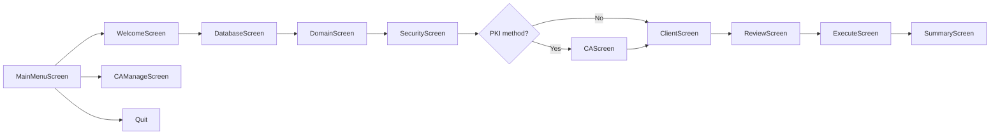
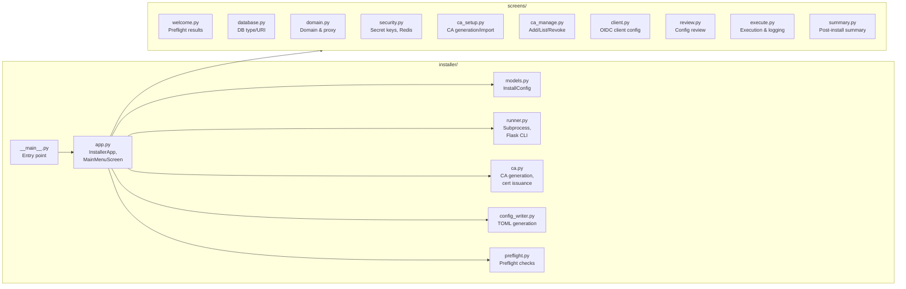

# X2FA — Installer

The X2FA installer is a Textual-based TUI (Text User Interface) that walks
through the complete setup process. It can be run as a standalone tool or
invoked programmatically.

## Installation

```bash
uv venv
source .venv/bin/activate
uv pip install -e ".[installer]"
```

Or use the entry point:

```bash
x2fa-install
```

## Entry Points

| Method | Command |
|--------|---------|
| Entry point | `x2fa-install` |
| Direct | `uv run --extra installer python -m installer` |
| Module | `uv run python -m installer` |

## Screens

The installer consists of 10 screens plus a main menu:

### Main Menu

| Button | Action |
|--------|--------|
| ⚙ Fresh Installation | Start the full setup wizard |
| 🔑 Manage CAs | Add, list, revoke, or renew CAs |
| ✕ Quit | Exit the installer |

### Installation Wizard

The wizard follows this flow:



### Screen Details

#### WelcomeScreen

- Displays preflight check results
- Shows system information (Python version, uv availability, port status)
- "Next" button only enabled after all checks pass
- Checks are cached to prevent re-evaluation on re-render

#### DatabaseScreen

| Field | Default | Options |
|-------|---------|---------|
| Database Type | `sqlite` | `sqlite`, `postgres`, `mysql` |
| Database URI | Auto-generated | User can override |

For SQLite, the database file is stored at `$X2FA_HOME/.local/share/x2fa/db.sqlite`.

For PostgreSQL/MySQL, the user provides a connection URI.

#### DomainScreen

| Field | Description |
|-------|-------------|
| Domain | Public hostname (e.g., `auth.example.com`) |
| Proxy Type | Reverse proxy: `caddy`, `nginx`, `traefik`, `other` |

Generates reverse proxy configuration snippets.

#### SecurityScreen

| Field | Description |
|-------|-------------|
| Secret Key | Auto-generated (32 bytes, hex) |
| Secret Salt | Auto-generated (32 bytes, hex) |
| Use Redis | Optional rate limiting backend |
| Redis URI | `redis://localhost:6379/0` |

#### CAScreen (Certificate Authority)

Shown only for PKI authentication methods (`tls_client_auth`, `private_key_jwt`).

| Option | Description |
|--------|-------------|
| Generate | Create a new CA key/cert pair |
| Import | Import an existing CA certificate |

**Generated CA:**

| Field | Default |
|-------|---------|
| CA Name | `x2fa-internal-ca` |
| CA Common Name | `X2FA Internal CA` |
| Validity Days | 3650 (10 years) |

**Imported CA:**

| Field | Description |
|-------|-------------|
| CA Import Path | Path to PEM-encoded certificate |

Path traversal protection: `_resolve_file()` validates the path.

#### ClientScreen

| Field | Description |
|-------|-------------|
| Client ID | Unique client identifier |
| Redirect URI | Valid redirect URI |
| Auth Method | See below |

**Authentication Method Options:**

| Method | Requires CA | Extra Fields |
|--------|-------------|--------------|
| `tls_client_auth` | Yes | — |
| `private_key_jwt` | Yes | JWKS URI |
| `self_signed_tls_client_auth` | No | Self-signed cert path |
| `client_secret_jwt` | No | — |
| `client_secret_post` | No | — |
| `client_secret_basic` | No | — |

#### ReviewScreen

Read-only summary of all configuration choices before execution.

#### ExecuteScreen

Performs the actual installation:

1. Writes TOML config files to `~/.config/x2fa/`
2. Initializes the database (`flask init-db`)
3. Generates signing keys (`flask init-keys`)
4. Generates/imports CA key and certificate
5. Registers the OIDC client
6. Issues client certificate (for PKI methods)
7. Displays generated files list

Uses `call_from_thread` to prevent UI freezes during long operations.
Subprocess calls have a 120-second timeout.

#### SummaryScreen (Post-Install)

Displays:

- Start command (`gunicorn` or `flask run`)
- Generated files list
- Reverse proxy configuration snippet
- Next-steps checklist
- Systemd enable command (if selected)

### CA Management Screen

Separate from the installation wizard, this screen manages existing CAs:

| Action | Description |
|--------|-------------|
| Add CA | Import a new CA certificate |
| List CAs | Display all registered CAs |
| Revoke CA | Deactivate a CA |
| Renew CA | Generate new cert for existing CA |

## Configuration Model

All installer choices are stored in `InstallConfig` (dataclass):

```python
@dataclass
class InstallConfig:
    # Database
    db_type: str = "sqlite"
    db_uri: str = ""
    
    # Domain & Proxy
    domain: str = ""
    proxy_type: str = "caddy"
    
    # Security
    secret_key: str = ""
    secret_salt: str = ""
    use_redis: bool = False
    redis_uri: str = "redis://localhost:6379/0"
    
    # CA
    ca_action: str = "generate"
    ca_name: str = "x2fa-internal-ca"
    ca_cn: str = "X2FA Internal CA"
    ca_validity_days: int = 3650
    ca_import_path: str = ""
    
    # Client
    client_id: str = ""
    client_redirect_uri: str = ""
    client_auth_method: str = "tls_client_auth"
    client_jwks_uri: str = ""
    client_self_signed_cert_path: str = ""
    
    # Deployment
    enable_systemd: bool = True
    
    # Results (transient)
    generated_files: list[str] = field(default_factory=list)
    install_error: str | None = None
    client_secret: str = ""
```

### Session Persistence

The installer persists user choices to `$X2FA_HOME/.local/share/x2fa/installer_session.json`.

Transient fields (`generated_files`, `install_error`, `client_secret`) are excluded.

## Preflight Checks

The WelcomeScreen runs these checks:

| Check | Description |
|-------|-------------|
| Python ≥ 3.11 | Required version |
| uv available | Package manager |
| Port 5000 free | Not already in use |
| Redis (optional) | Available if `use_redis=True` |

## Security Features

### Path Traversal Protection

CA import paths are validated using `_resolve_file()`:

```python
def _resolve_file(path_str: str, label: str = "path") -> Path:
    p = Path(path_str).expanduser().resolve()
    if not p.is_file():
        raise click.ClickException(f"{label}: file does not exist: {path_str}")
    return p
```

### Race Condition Prevention

The `ExecuteScreen` uses `call_from_thread` for `generated_files` mutation
to prevent DOM race conditions during long-running subprocess calls.

### Subprocess Timeout

All Flask CLI calls have a 120-second timeout:

```python
result = subprocess.run(
    [sys.executable, "-m", "flask", "init-db"],
    capture_output=True, timeout=120
)
```

### TOCTOU Fix

The WelcomeScreen uses EAFP (Easier to Ask Forgiveness than Permission)
instead of `os.access()` to avoid time-of-check to time-of-use races.

## Usage Examples

### Fresh Installation

```bash
x2fa-install
# Follow the wizard:
# 1. Welcome → Next
# 2. Database → SQLite (default) → Next
# 3. Domain → auth.example.com → Next
# 4. Security → Accept defaults → Next
# 5. CA → Generate → Next
# 6. Client → Enter details → Next
# 7. Review → Execute
# 8. Summary → Done
```

### CA Management

```bash
x2fa-install
# Select "Manage CAs" → Add CA → Enter name and cert path
```

### Relocate Home Directory

```bash
x2fa-install --x2fa-home /opt/x2fa
```

