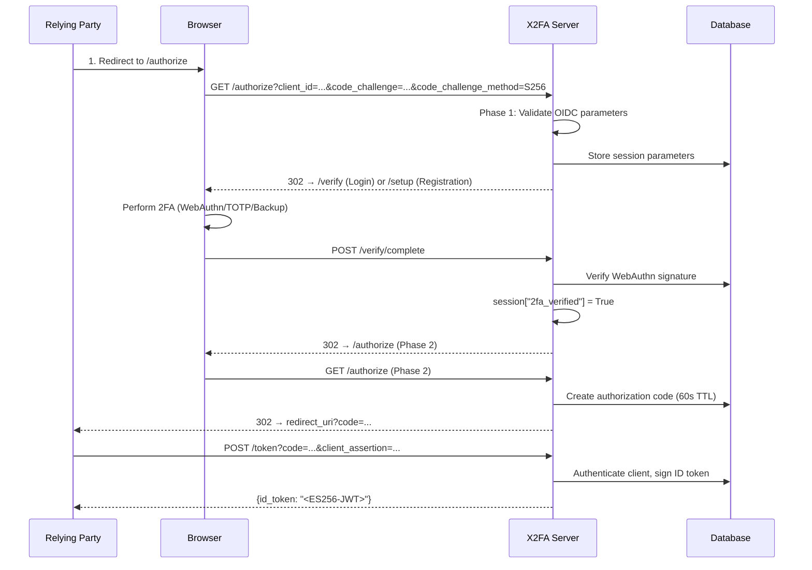
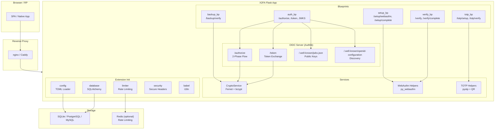
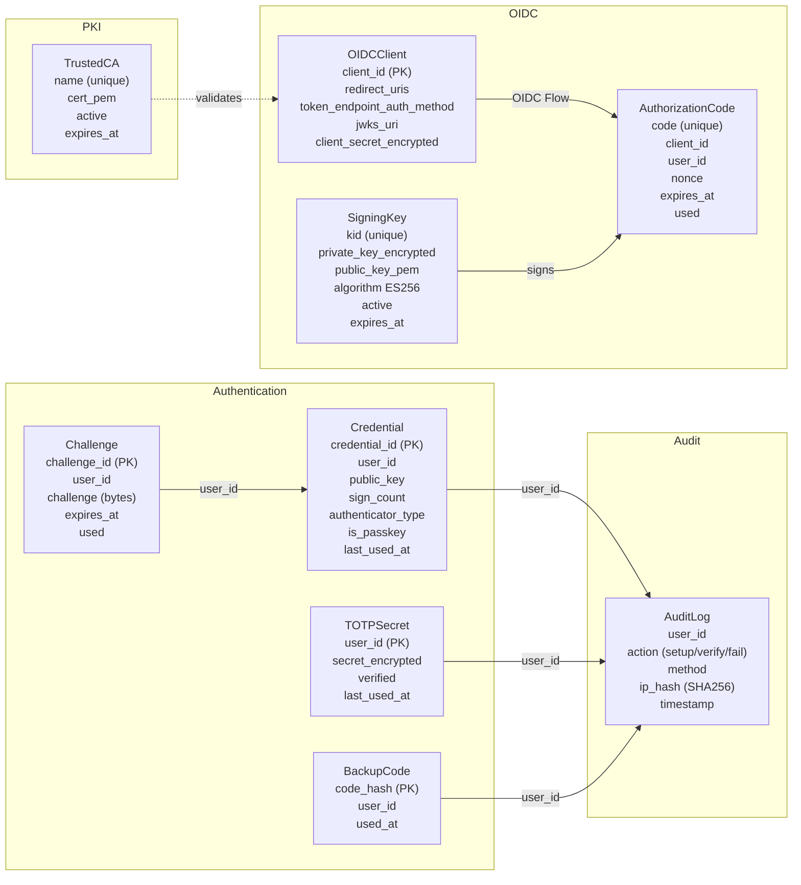
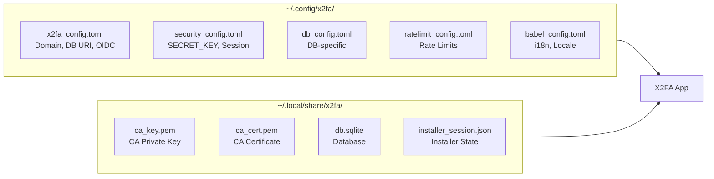
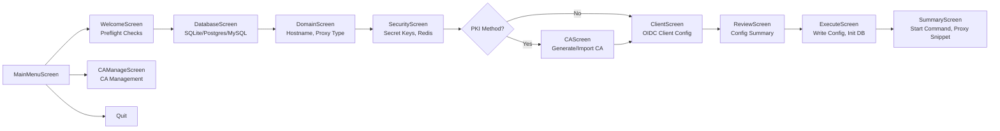

# X2FA — Project Introduction

X2FA is a FIDO2 / TOTP microservice with an integrated OIDC provider. It provides
two-factor authentication (2FA) for relying parties (RPs) and supports six client
authentication methods — from PKI-based (mTLS, private_key_jwt) to shared-secret approaches.

## What does X2FA do?

X2FA acts as a central 2FA and OIDC identity provider:

1. **OIDC Authentication** — An RP redirects the user to the X2FA server,
   where the user authenticates with 2FA. After successful login, the RP
   receives an ES256-signed ID token.

2. **Two-Factor Authentication** — Users can authenticate with WebAuthn/FIDO2
   (Touch ID, Windows Hello, YubiKey), TOTP (authenticator app), or backup codes.

3. **Client Registration** — RPs are registered with one of six authentication methods:
   mTLS, private_key_jwt, self-signed TLS, client_secret_jwt,
   client_secret_post, client_secret_basic.

## Core Concepts

### OIDC Authorization Code Flow with PKCE



### Two-Phase Authorization

The `/authorize` endpoint operates in two phases:

1. **Phase 1** — OIDC parameters are validated and stored in the Flask session.
   The browser is redirected to the 2FA UI (`/verify` or `/setup`).
2. **Phase 2** — After successful 2FA (`session["2fa_verified"] = True`),
   Authlib creates the authorization code and redirects back to the RP.

This design keeps OIDC parameters out of URLs (no URL-based state).

### 2FA Methods

| Method | Description | Usage |
|--------|-------------|-------|
| **WebAuthn Platform** | Biometrics/TPM (Touch ID, Windows Hello) | Primary method |
| **WebAuthn Roaming** | USB/NFC/BLE (YubiKey, Nitrokey) | Primary method |
| **TOTP** | Time-based one-time passwords (authenticator app) | Fallback |
| **Backup Codes** | 10 single-use 8-character hex codes (bcrypt-hashed) | Emergency access |

### Client Authentication Methods

| Method | Type | Requires CA | Description |
|--------|------|-------------|-------------|
| `tls_client_auth` | PKI | Yes | mTLS — client certificate verified during TLS handshake |
| `private_key_jwt` | PKI | Yes | JWT client assertion with JWKS URI or x5c |
| `self_signed_tls_client_auth` | PKI | No | Self-signed certificate, fingerprint matching |
| `client_secret_jwt` | Shared Secret | No | JWT with HMAC signature (HS256) |
| `client_secret_post` | Shared Secret | No | Shared secret in POST body |
| `client_secret_basic` | Shared Secret | No | Shared secret in Basic-Auth header |

PKI methods (`tls_client_auth`, `private_key_jwt`) require a registered
Certificate Authority (CA). Shared-secret methods use a once-generated,
Fernet-encrypted secret.

## Technical Architecture



### Layers

| Layer | Component | Technology |
|-------|-----------|------------|
| **Blueprints** | 5 route blueprints | Flask Blueprints |
| **OIDC Server** | Authlib integration | authlib 1.6+ |
| **Services** | Crypto, WebAuthn, TOTP | cryptography, py_webauthn, pyotp |
| **Extension Init** | Flask extensions | flask-sqlalchemy, flask-limiter, flask-babel |
| **Database** | SQLAlchemy ORM | SQLite (default), PostgreSQL, MySQL |

## Data Model

X2FA uses 8 SQLAlchemy models:



### Key Design Decisions

| Decision | Rationale |
|----------|-----------|
| **No shared secrets for mTLS/JWT** | PKI-based methods are more secure than shared secrets |
| **IP addresses hashed** | GDPR compliance — `SHA256(ip + X2FA_SECRET)` instead of plaintext |
| **Nonces kept in AuthorizationCodes** | Codes are not deleted after token exchange (only `used=True` marked). `cleanup-codes` removes them after 1h. This prevents the RP from being unable to process an ID token after 60s expiry. The real replay protection comes from the fact that the authorization code itself cannot be exchanged again (`used=True`). |
| **Sentinel values** | `NEVER_USED` (1970) and `NEVER_EXPIRES` (9999) as timezone-naive datetime values |
| **Session-based OIDC state** | No URL-based parameters — protection against log leakage |
| **Fernet encryption** | Symmetric encryption for secrets (client_secret, TOTP, SigningKey) |
| **bcrypt for backup codes** | 12 rounds, single-use, linear comparison |

## Configuration

X2FA uses XDG-compliant TOML configuration files:



Override with `X2FA_HOME`:

```bash
X2FA_HOME=/tmp/x2fa-test FLASK_APP=x2fa.wsgi:app uv run flask run
```

## Installer

The X2FA installer is a Textual-based TUI (Text User Interface) that walks
the user through the complete setup process:



The installer:
- Generates TOML configuration files
- Initializes the database (Alembic migrations)
- Creates ES256 signing keys
- Generates/imports CA certificates
- Registers the first OIDC client
- Issues client certificates (for PKI methods)

## Security

| Feature | Implementation |
|---------|----------------|
| **PKCE S256 mandatory** | `plain` is explicitly rejected |
| **ES256 ID tokens** | EC P-256 signatures, public keys via JWKS |
| **SSL verification** | JWKS fetch with `ssl.CERT_REQUIRED` + `check_hostname` |
| **Rate limiting** | Per-endpoint configurable, Redis for multi-worker |
| **Path traversal protection** | `_resolve_file()` validates all file paths |
| **Race condition prevention** | `call_from_thread` in ExecuteScreen, EAFP instead of `os.access()` |
| **Subprocess timeout** | 120s timeout for all Flask CLI calls |
| **Sign count regression** | Detection of cloned authenticators |
| **TOTP anti-replay** | 30-second window, `last_used_at` check |
| **Backup code hashing** | bcrypt with 12 rounds, single-use |
| **Secrets encryption** | Fernet (AES-128-CBC) for client_secret, TOTP, SigningKey |

## Testing

```bash
# Run all tests
uv run pytest tests/ -v

# Unit tests only (no DB, no I/O)
uv run pytest tests/ -m unit -v

# Single test
uv run pytest tests/test_file.py::test_name -v

# E2E tests
uv run pytest tests/e2e/ -v
```

29 unit tests + E2E tests for the installer.

## Quick Reference

| Task | Command |
|------|---------|
| Initialize database | `FLASK_APP=x2fa.wsgi_cli:app uv run flask init-db` |
| Create signing keys | `FLASK_APP=x2fa.wsgi_cli:app uv run flask init-keys` |
| Register OIDC client | `FLASK_APP=x2fa.wsgi_cli:app uv run flask add-client <id> <uri> [--method <method>]` |
| Add CA | `FLASK_APP=x2fa.wsgi_cli:app uv run flask add-ca <name> <cert>` |
| Issue client cert | `FLASK_APP=x2fa.wsgi_cli:app uv run flask issue-client-cert <id> --ca <name>` |
| Apply migrations | `FLASK_APP=x2fa.wsgi_cli:app uv run flask db-upgrade` |
| Cleanup | `FLASK_APP=x2fa.wsgi_cli:app uv run flask cleanup-codes` |

## Documentation Structure

| File | Content |
|------|---------|
| `getting-started.md` | Installation, quickstart, configuration |
| `architecture.md` | System design, request flows, data models, session management |
| `cli-reference.md` | All Flask CLI commands, path resolution, security features |
| `oidc-auth.md` | OIDC discovery, 6 auth methods, authorization/token endpoint, 2FA flows |
| `installer.md` | Textual TUI, screens, InstallConfig, preflight checks |
| `security.md` | Cryptography, audit logging, WebAuthn security, PKCE, rate limiting |