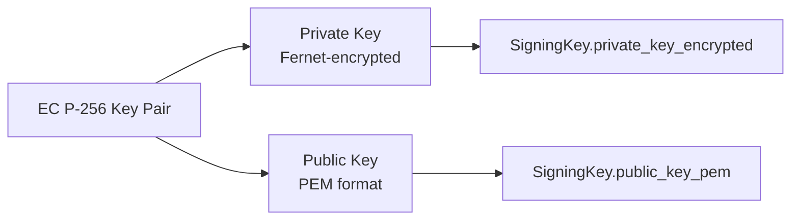

# X2FA — Security

X2FA implements security best practices across authentication, encryption,
audit logging, and input validation.

## 1. Authentication Methods

X2FA supports six OIDC client authentication methods:

| Method | Type | Requires CA |
|--------|------|-------------|
| `tls_client_auth` | PKI (mTLS) | Yes |
| `private_key_jwt` | PKI (JWT) | Yes |
| `self_signed_tls_client_auth` | PKI (self-signed) | No (but cert must be imported) |
| `client_secret_jwt` | Shared Secret | No |
| `client_secret_post` | Shared Secret | No |
| `client_secret_basic` | Shared Secret | No |

### PKI Methods

Require a trusted CA registered in X2FA. The CA signs client certificates
which are presented during the TLS handshake or used for JWT signing.

**CA Methods:**
- **Generate:** Creates EC P-256 CA key pair and self-signed certificate
- **Import:** Loads existing CA certificate from PEM file

**Client Certificate Issuance:**
- Generates EC P-256 key pair
- Creates CSR with CN = client_id
- Signs with the trusted CA
- Writes key and cert to `~/.local/share/x2fa/`

### Shared Secret Methods

Generate a 64-character hex secret stored Fernet-encrypted in the database.
The plaintext is shown only once during creation.

## 2. Encryption

### Algorithms

| Data | Algorithm | Storage |
|------|-----------|---------|
| ID token signing | ES256 (EC P-256) | Fernet-encrypted private key |
| Client secrets | Fernet (AES-128-CBC) | Fernet-encrypted in DB |
| TOTP secrets | Fernet (AES-128-CBC) | Fernet-encrypted in DB |
| Backup codes | bcrypt (12 rounds) | bcrypt hash in DB |
| WebAuthn credentials | ECDSA P-256 | Raw bytes in DB |

### Key Management

Signing keys are generated via `flask init-keys` or `flask rotate-keys`:



Keys can be rotated without downtime. Multiple active keys are supported
(the JWKS endpoint returns all active, non-expired keys).

## 3. Audit Logging

### Model

```python
class AuditLog(Base):
    user_id: str          # User identifier
    action: str           # "setup" | "verify" | "fail"
    method: str           # "webauthn_platform" | "totp" | "backup" | ...
    ip_hash: str          # SHA256(ip + X2FA_SECRET)
    timestamp: datetime   # UTC
```

### GDPR Compliance

**IP addresses are never stored in plaintext.** The audit log contains:

```
ip_hash = SHA256(client_ip + X2FA_SECRET)
```

The `X2FA_SECRET` is loaded from the security config, ensuring that even
if the audit log is compromised, IPs cannot be reversed without the secret.

### Audit Events

| Event | Action | Method |
|-------|--------|--------|
| WebAuthn registration | `setup` | `webauthn_platform` / `webauthn_roaming` |
| WebAuthn verification | `verify` | `webauthn_platform` / `webauthn_roaming` |
| WebAuthn failure | `fail` | `webauthn_roaming` |
| TOTP setup | `setup` | `totp` |
| TOTP verification | `verify` | `totp` |
| TOTP failure | `fail` | `totp` |
| Backup code redemption | `verify` | `backup` |
| Backup code failure | `fail` | `backup` |

## 4. WebAuthn / FIDO2 Security

### Challenge Management

- 32 bytes of cryptographic entropy per challenge
- 5-minute TTL (configurable)
- Single-use (marked `used=True` after verification)
- Bound to `user_id` to prevent cross-user replay

### Credential Storage

- `credential_id`: Raw bytes (primary key)
- `public_key`: Raw bytes (WebAuthn public key)
- `sign_count`: Authenticator sign counter (detects cloned devices)
- `last_used_at`: `NEVER_USED` sentinel until first successful assertion

### Sign Count Regression Detection

If `verify_authentication` returns a sign_count lower than the stored value,
it indicates a cloned authenticator. The verification raises a `ValueError`.

## 5. TOTP Security

### Anti-Replay

TOTP codes are verified against a time window centered on the current time.
The `last_used_at` field prevents replay within the 30-second window:

```python
def verify_code(secret, code, last_used_at):
    # Check current and adjacent time steps
    for offset in [-1, 0, 1]:
        if pyotp.TOTP(secret).verify(code, now=time + offset * 30):
            # Check last_used_at to prevent replay
            if last_used_at + timedelta(seconds=30) > now:
                raise ValueError("Code already used")
            return True
    return False
```

### Provisioning URI

```
otpauth://totp/X2FA:user1?secret=XXXX&issuer=X2FA
```

QR codes are generated as data URIs (no external service required).

## 6. Backup Codes

### Generation

10 single-use backup codes per registration:

```python
def generate_backup_codes(count=10):
    return [secrets.token_hex(5).upper() for _ in range(count)]
    # Format: 10-character hex strings (e.g., "A3F2B9C1D4")
```

### Storage

Codes are bcrypt-hashed (12 rounds) before storage:

```python
code_hash = bcrypt.hashpw(code.encode(), bcrypt.gensalt(rounds=12))
```

### Verification

Linear search through active codes (not yet used):

```python
for record in valid_codes:
    if CryptoService.verify_backup_code(code, record.code_hash):
        # Mark as used
        record.used_at = datetime.now(timezone.utc)
        break
```

### Cleanup

Expired codes are cleaned up by `flask cleanup-codes`:

```bash
FLASK_APP=x2fa.wsgi_cli:app uv run flask cleanup-codes
```

Keeps codes active for at least 1 hour to protect against nonce replay.

## 7. PKCE Enforcement

PKCE S256 is **mandatory**. The `plain` challenge method is explicitly rejected:

```python
if code_challenge_method != "S256":
    abort(HTTPStatus.BAD_REQUEST,
          _("Only code_challenge_method=S256 is supported."))
```

The code verifier is stored during `/authorize` and verified at `/token`.

## 8. OIDC Security

### Session-Based State

OIDC parameters are stored in the Flask server-side session, not in URLs:

```
GET /authorize?client_id=rp1&redirect_uri=https://rp1/callback&...
    → session["oidc_request"] = {...}
    → 302 /verify
```

This prevents:
- URL-based state leakage in logs/referer headers
- OIDC parameter tampering
- Session fixation (session ID rotated after 2FA)

### Error Handling

Error redirects use `_oidc_error_redirect()` to prevent state leakage:

```python
def _oidc_error_redirect(error: str, description: str = ""):
    # Clean up sensitive session data
    for key in ("oidc_request", "user_id", "2fa_verified", "setup_mode"):
        session.pop(key, None)
    
    # Redirect with error params only
    return redirect(f"{redirect_uri}?error={error}&state={state}")
```

### Nonce Replay Protection

AuthorizationCodes are not physically deleted after token exchange (only `used=True` marked).
`cleanup-codes` removes them after 1h. This allows the RP to process the ID token
(60s expiry) even after the token exchange. The real replay protection comes from
the fact that the AuthorizationCode itself cannot be exchanged again (`used=True`).

- `None` nonce is valid (OIDC Core specifies nonce as optional in the code flow)

## 9. Rate Limiting

All verification endpoints are rate-limited via Flask-Limiter:

| Endpoint | Limit |
|----------|-------|
| `/authorize` | Configurable |
| `/token` | Configurable |
| `/verify/complete` | Configurable |
| `/setup/complete` | Configurable |
| `/totp/setup/verify` | Configurable |
| `/totp/verify` | Configurable |
| `/backup/verify` | Configurable |

Configuration is in `ratelimit_config.toml`:

```toml
[rate_limit]
authorize = "10/minute"
token = "10/minute"
webauthn_verify = "5/minute"
setup_complete = "5/minute"
totp_setup = "5/minute"
totp_verify = "5/minute"
backup_verify = "5/minute"
```

## 10. Input Validation

### Path Traversal Protection

All file paths are validated using `_resolve_file()`:

```python
def _resolve_file(path_str: str, label: str = "path") -> Path:
    p = Path(path_str).expanduser().resolve()
    if not p.is_file():
        raise click.ClickException(f"{label}: file does not exist: {path_str}")
    return p
```

- Resolves symlinks and relative paths
- Only accepts regular files (not directories or symlinks to arbitrary locations)
- Validates parent directory is writable

### CA Certificate Verification

`TrustedCA.verify_certificate()` validates:

1. PEM is a valid X.509 certificate
2. Certificate is within its validity period
3. Certificate is signed by this CA (RSA PKCS1v15 or ECDSA)
4. CN attribute is present (used as client_id)

### SQL Injection Prevention

All queries use SQLAlchemy ORM or parameterized queries:

```python
# Safe — ORM
stmt = select(Credential).where(Credential.user_id == user_id)

# Safe — parameterized
stmt = select(BackupCode).where(
    BackupCode.user_id == user_id,
    BackupCode.used_at == NEVER_USED
)
```

## 11. Security Headers

The `secure` package enforces security headers:

| Header | Value |
|--------|-------|
| `X-Content-Type-Options` | `nosniff` |
| `X-Frame-Options` | `DENY` |
| `Content-Security-Policy` | Restricted (nonce-based) |
| `Referrer-Policy` | `strict-origin-when-cross-origin` |

**Note:** `Strict-Transport-Security` and `X-XSS-Protection` are not set.
HSTS should be enforced by the reverse proxy (nginx/Caddy) in front of X2FA.

## 12. TLS / SSL Verification

### JWKS Fetch

When fetching JWKS for `private_key_jwt` verification:

```python
import ssl

context = ssl.create_default_context()
context.check_hostname = True
context.verify_mode = ssl.CERT_REQUIRED

response = requests.get(jwks_uri, ssl=context)
```

This prevents MITM attacks on JWKS endpoint fetches.

## 13. File Permissions

CA key files are written with restrictive permissions:

```python
ca_key_path.write_bytes(key_pem)
ca_key_path.chmod(0o600)  # Owner read/write only
```

## 14. Security Checklist

| Check | Status |
|-------|--------|
| PKCE S256 mandatory | ✅ |
| No shared secrets for mTLS/JWT methods | ✅ |
| IP addresses hashed in audit log | ✅ |
| Challenges single-use with TTL | ✅ |
| Backup codes bcrypt-hashed | ✅ |
| Client secrets Fernet-encrypted | ✅ |
| ID tokens ES256-signed | ✅ |
| JWKS fetch with SSL verification | ✅ |
| Path traversal protection | ✅ |
| Rate limiting on all verification endpoints | ✅ |
| Security headers (CSP, X-Frame-Options, etc.) | ✅ |
| AuthorizationCode not deleted after use (used=True) | ✅ |
| Sign count regression detection | ✅ |
| TOCTOU race prevention | ✅ |
| Subprocess timeout (120s) | ✅ |